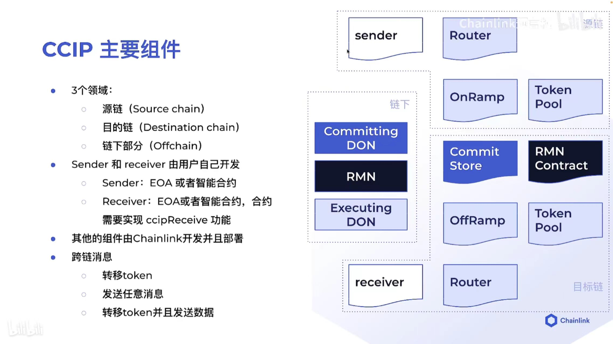
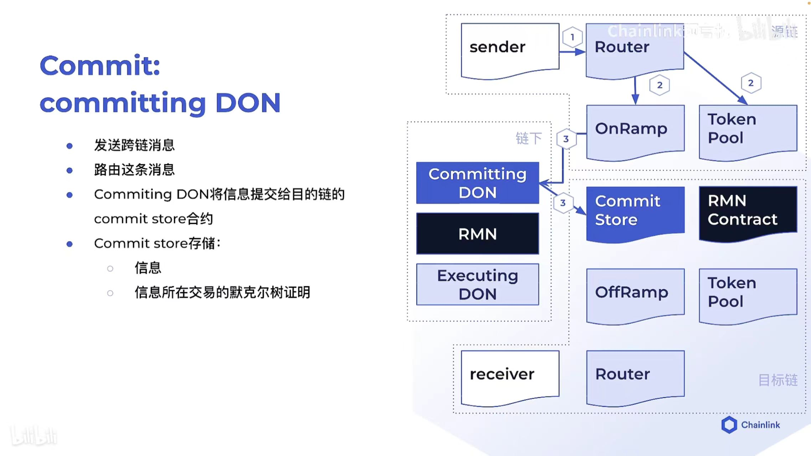
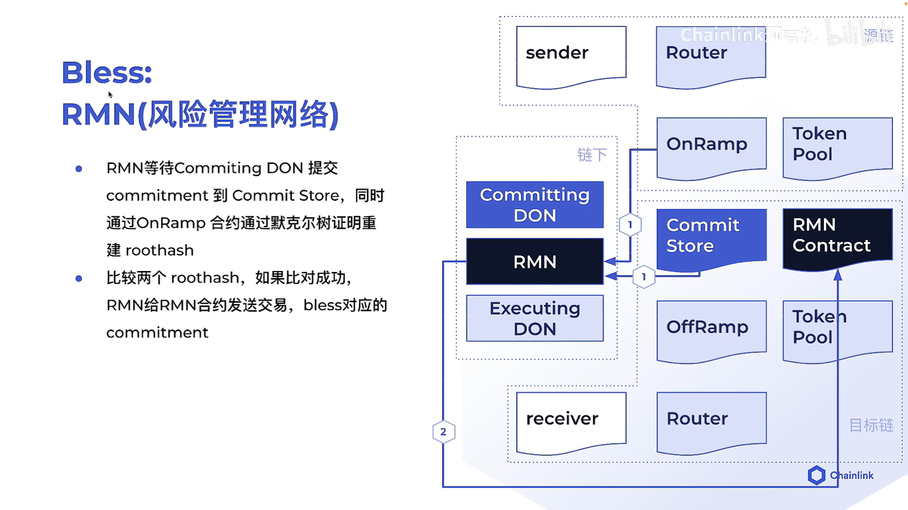
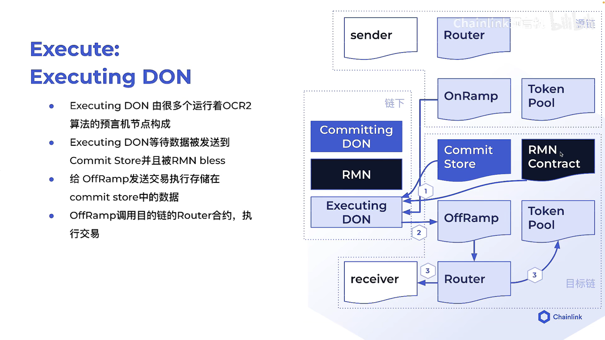
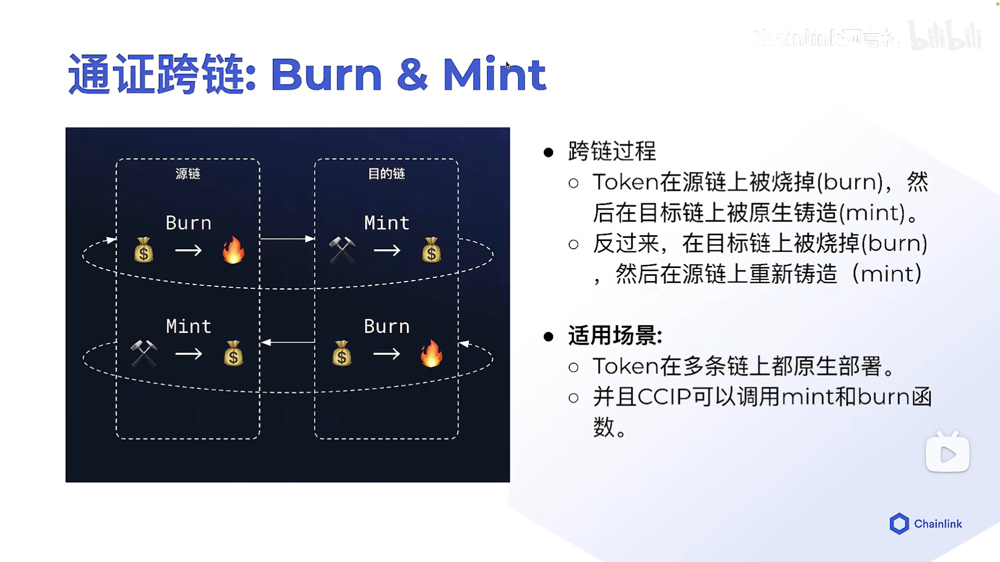
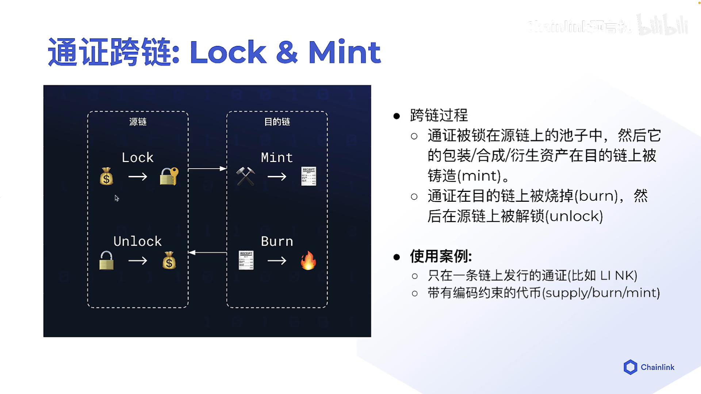
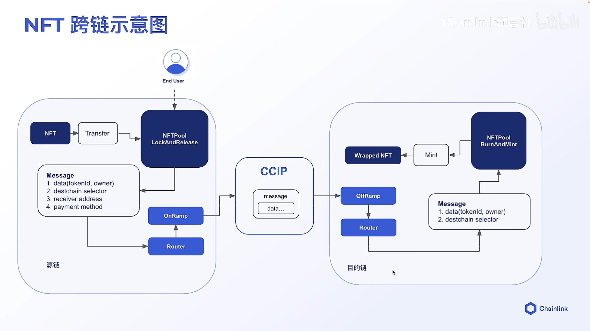

# 第6课 跨链应用
## 1.NFT介绍
同质化通证 fungible token
法币，粮食。可以拆分，可以无差别兑换

非同质化通证  non-fungible token
房子，画。不可以拆分，不可以无差别兑换

社区身份，游戏道具，参会证明，资产质押证明，会员卡等

NFT被哪些合约规范了呢？NFT的合约规范
特性          ERC-721         ERC-1155
同质化        非同质化          同质化&非同质化
批次处理      每次处理1个批次    每次处理多个通证

2.ERC-721
实现2个NFT池子，利用这两个NFT池子来实现跨链
https://wizard.openzeppelin.com/#erc721&name=MyToken&symbol=MTK

3.跨链项目初始化
>mkdir crosschain-nft

初始化nodejs项目
>npm init -y

安装hardhat
>npm install hardhat -D

创建hardhat项目
>npx hardhat init

19:10

4.NFT的metadata
https://opensea.io/
https://docs.opensea.io/docs/metadata-standards
metadata:{
    name: "",
    traits:[
        {
            trait_type: "Stamina",
            value: 3
        },{}]
}
这些metadata数据，一般存储在去中心化的存储网络。包括IPFS, Arweave, Storj

5.去中心化存储
https://ipfs.tech/

https://filebase.com/

部署MyToken.sol
safeMint 账户地址
登录
https://testnets.opensea.io/account
account = 账户地址
及可查看刚才铸造好的NFT

6.NFT跨链
如果我想把sepolia的NFT，转移到polygen链上。

跨链的发展阶段
a.通证跨链
将通证从一条链转移给另一条链的一个智能合约地址或者EOA

b.可编程的通证跨链
将通证以及相关指令（要如何操作这个token）从一条链发给另一条链的智能合约

c.任意信息跨链
将任意信息（字节）从一条链转移给另一条链用于接受的智能合约

难点：
我如何保证跨链信息的准确，第一条链信息是a，转移到第二条链上还是a.或者说转移到第二条链上变成了b.
谁有资格跨链？
谁又有资格去验证？
我如何相信这个验证？

7.chainlink CCIP
chainlink提供的跨链协议

组件

步骤1

Router：
要加入目标链
receive地址

OnRamp：
发送event

Committing DON:
收到OnRamp发送的event以后，就会将event的数据从源链上读取，然后写入CommitStore中

步骤2

RMN的作用是去检测CommitStore里面的数据和OnRamp里面的数据是否是相同的（默克尔树证明）
在RMN Contract合约中对数据进行标注

步骤3

当RMN将数据标注为合法的时候，Executing DON通过OffRamp通过recevie的地址找到recevier合约，完成操作

8.通证跨链的方式
Burn & Mint

要求在2条链上都有部署Burn & Mint合约
通过跨链协议，你有调用这个函数的权限

Lock & Mint(推荐)

你作为资产的所有人，你可以将资产进行transfer,再目标链上包装/合成一个新的资产

NFT跨链示意图

代码
1:07:18

通过MyToken合约对NFT在pool中锁定，通过Wrapped在另一个pool中铸造一个新的NFT

10.NFT Pool
锁定和解锁定的池子，另一个是burn和mint池子

使用CCIP协议

我们需要通过NFTPoolLockAndRelease发送一条信息:NFT已经锁在这个合约地址里面了。
然后发送信息告诉CCIP，被锁的token它的tokenId是什么，我要发送过去在新的池子里面去mint一个新的NFT,新的NFT它的owner是谁。需要把这两个基础数据写在message里面（tokenId, owner）。同时还有destination selector 和 receiver address, payment method

首先完成在源链上部署的池子：

_ccipReceive接收的信息是Client.Any2EVMMessage
_buildCCIPMessage发送的信息是Client.EVM2AnyMessage

sendMessagePayLINK(){

先_buildCCIPMessage

跨链是由Router合约去完成的        
IRouterClient router = IRouterClient(this.getRouter());

发送
messageId = router.ccipSend(_destinationChainSelector, evm2AnyMessage);
}

我们需要做的事
lockAndSendNFT(tokenId, newOwner){
    把他们包装在payload里面，将payload当做text传输进去。在通过text生成要传输的信息
}

接着完成在目标链上部署NFT的池子：
它如何接收发来的信息，并且WrappedNFT进行mint

1:38:40

从目标链上burn，在源链上unlock NFT，发送给owner的地址
1:46:13

11.多链部署脚本
1:55:00

